# Personal Development Hub

A Flutter application designed to help users achieve their personal development goals through organization, knowledge acquisition, and mindful habits.

## Features

- **Dynamic Landing Screen**: A welcoming initial screen featuring a dynamic background image, an animated display of inspirational lines, and a clear call to action to sign in.
- **User-Friendly Sign-In Screen**: A dedicated sign-in interface with blurred text fields for a modern aesthetic and clear input prompts.
- **Customizable Backgrounds**: Distinct background images for both the landing and sign-in screens to provide a unique visual experience.
- **Navigation**: Seamless navigation between the landing screen and the sign-in screen.

## Getting Started

These instructions will get you a copy of the project up and running on your local machine for development and testing purposes.

### Prerequisites

Ensure you have Flutter installed. If not, follow the official Flutter installation guide:

*   [Flutter Installation Guide](https://flutter.dev/docs/get-started/install)

### Installing

1.  **Clone the repository:**

    ```bash
    git clone <repository-url>
    cd pdh
    ```

2.  **Install dependencies:**

    ```bash
    flutter pub get
    ```

3.  **Ensure assets are available:**

    Make sure all necessary background images are in the `assets/` directory and listed in `pubspec.yaml`:

    ```yaml
    flutter:
      uses-material-design: true
      assets:
        - flutter_01.png
        - assets/landing_screen.jpg
        - assets/hillyxyz_Generate_a_background_image_for_a_personal_development_app._Theme_0e1e972b-4933-4004-94fa-23e1d21d8be7.png
        - assets/hillyxyz_Generate_a_background_image_for_a_personal_development_app._Theme_1b482d56-7423-46ca-8b2d-ea094e0e91f6.png
    ```

    (Note: `flutter pub get` should automatically pick up changes to `pubspec.yaml`, but a full restart of your IDE or `flutter clean` might be necessary if assets are not loading.)

## Running the App

To run the app on an attached device or emulator:

```bash
flutter run
```

## Screenshots

### Employee Portal

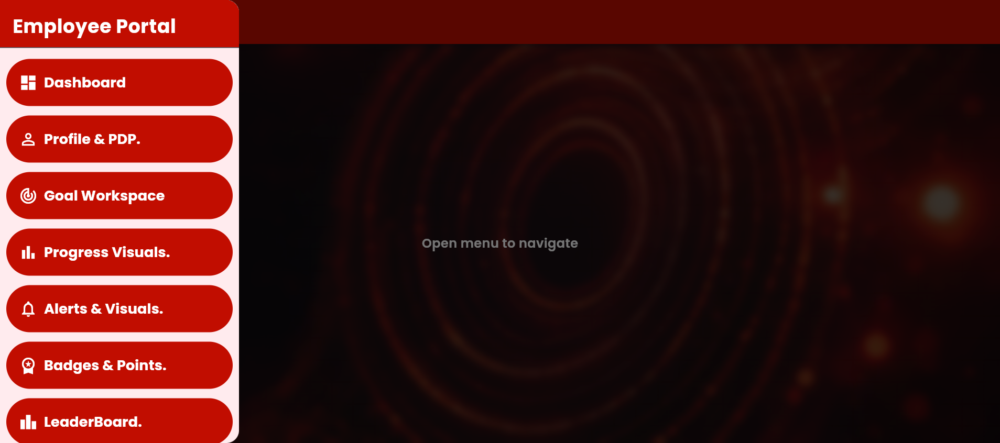

### Employee Dashboard

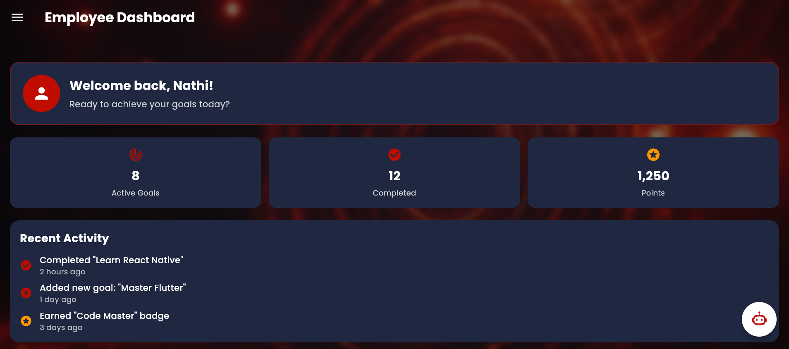

### My Personal Development Plan

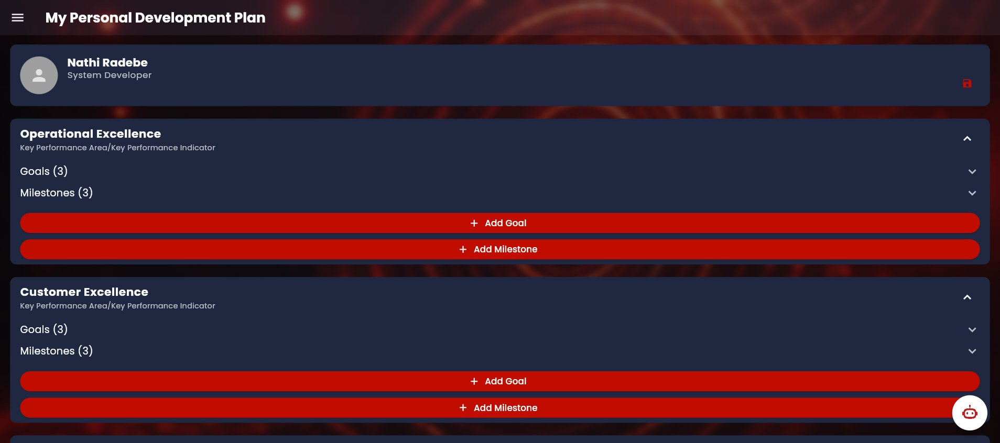

### Personal Development Goal - Goal Information

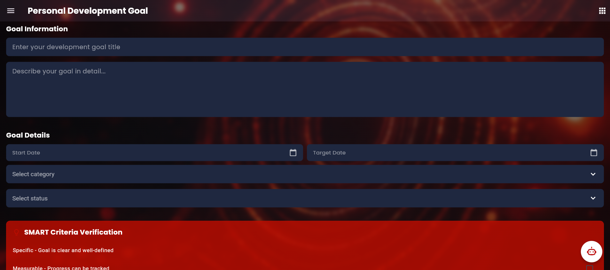

### Personal Development Goal - SMART Criteria Verification

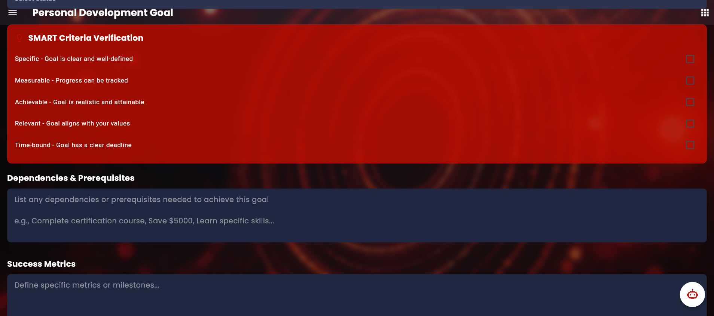

### Progress Visuals

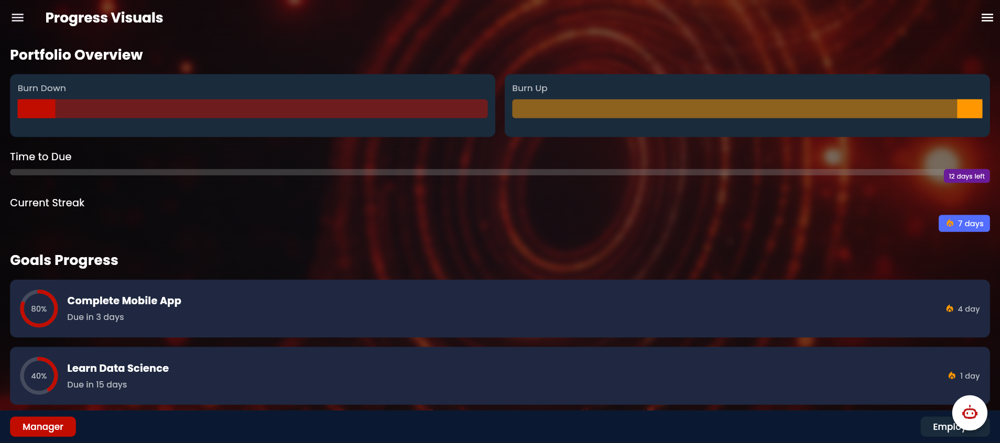

### Alerts & Nudges

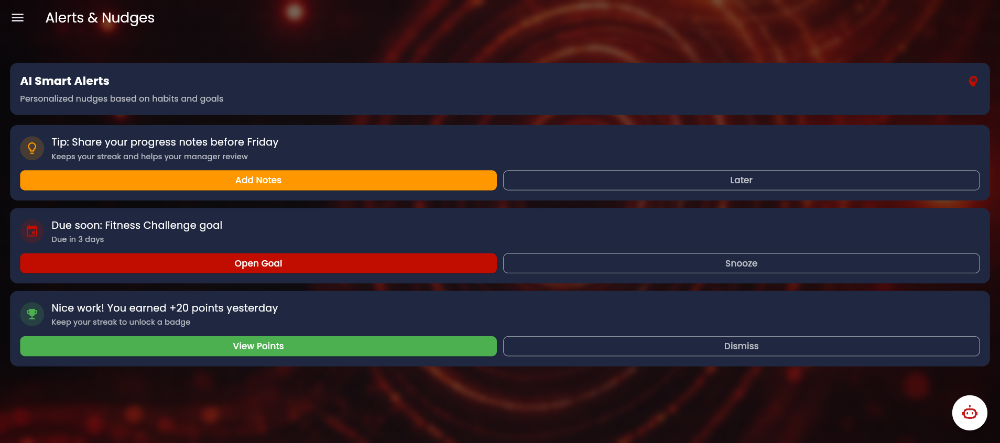

### Badges & Points - Overview

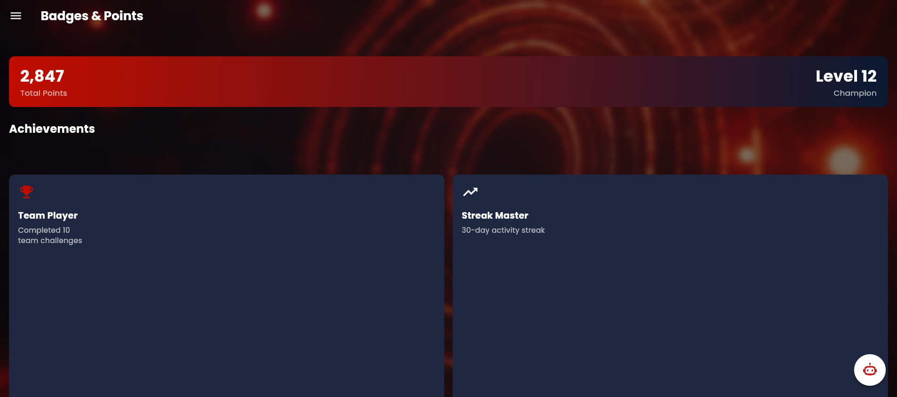

### Badges & Points - Recent Celebrations and AI Smart Alerts

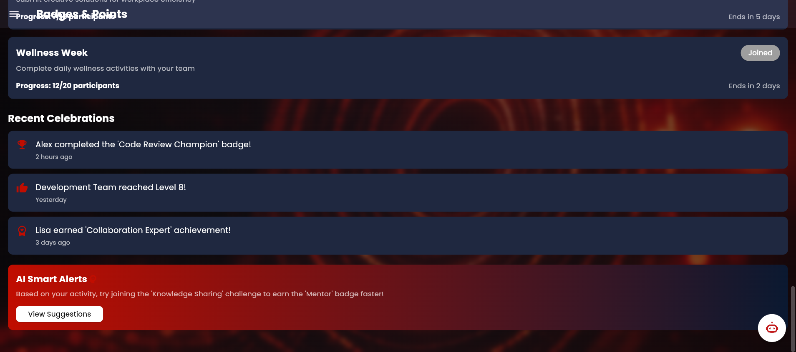

### Leaderboard

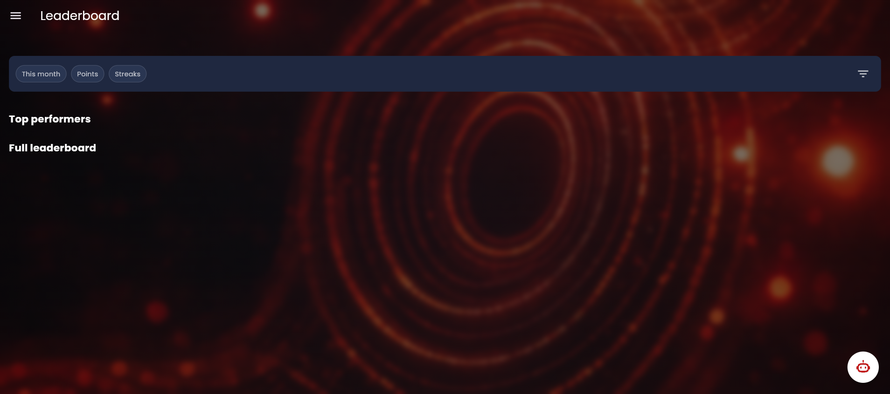

### Repository & Audit - Completed Goals Archive

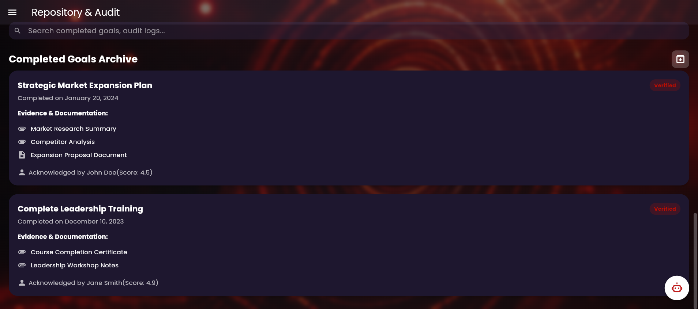

### Repository & Audit - Employee Portal Navigation

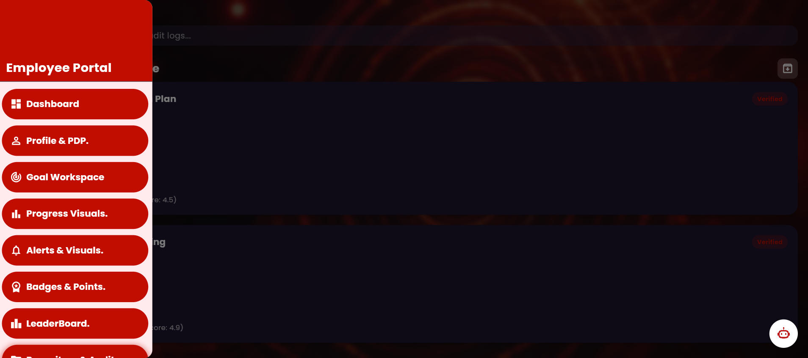

### Settings - Employee Settings

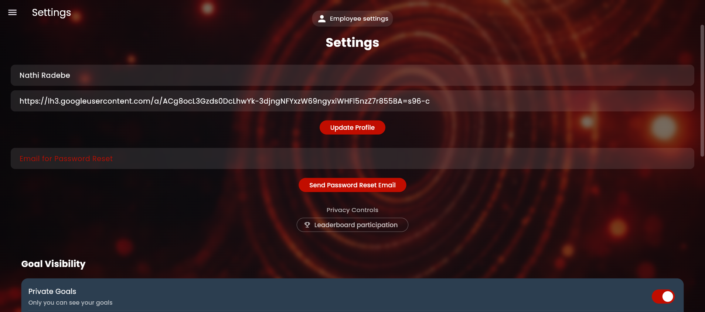

### Settings - Employee Portal Navigation

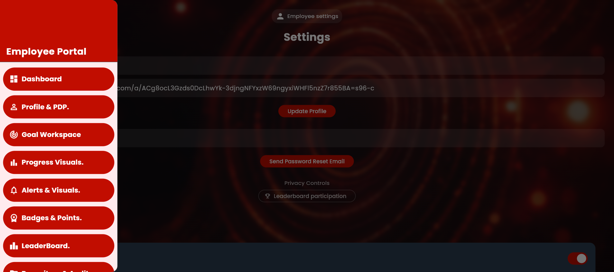

### AI Chatbot - Initial Greeting

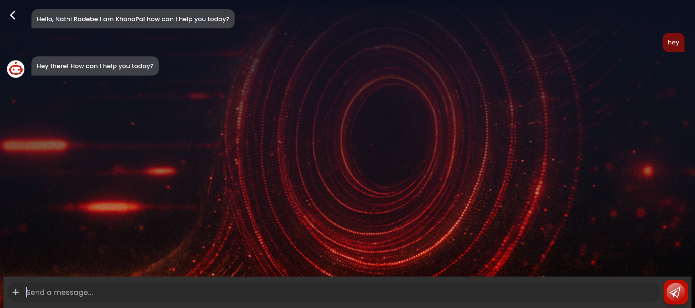

### AI Chatbot - Mode Selection

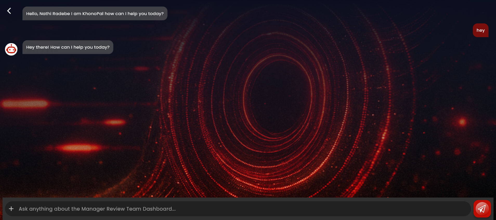